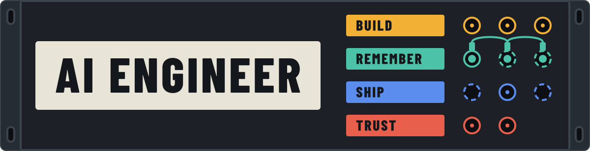
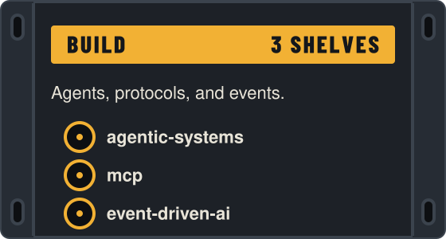
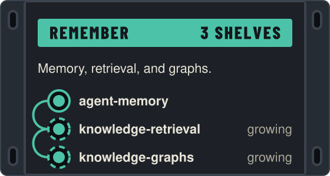
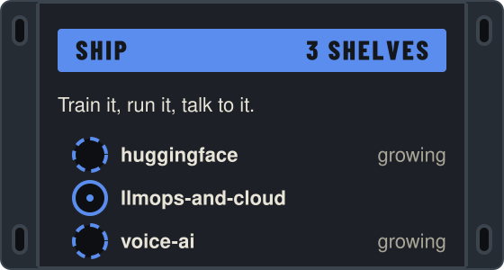
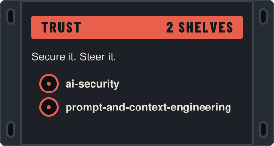
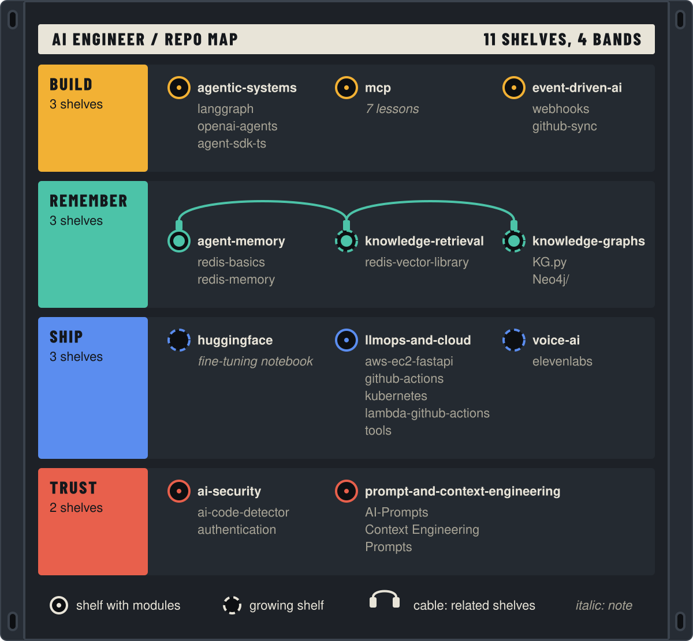

<p align="center">
  
</p>

<p align="center">
  
  
  
</p>

Runnable AI engineering modules, shelved by what you want to do. Each module has its own README with a run command, the keys it needs, and what it depends on.

Pick a band, then a shelf.

<table>
  <tr>
    <td width="50%" valign="top">
      <a href="#build"></a><br>
      <a href="agentic-systems/"><code>agentic-systems</code></a> · <a href="mcp/"><code>mcp</code></a> · <a href="event-driven-ai/"><code>event-driven-ai</code></a>
    </td>
    <td width="50%" valign="top">
      <a href="#remember"></a><br>
      <a href="agent-memory/"><code>agent-memory</code></a> · <a href="knowledge-retrieval/"><code>knowledge-retrieval</code></a> · <a href="knowledge-graphs/"><code>knowledge-graphs</code></a>
    </td>
  </tr>
  <tr>
    <td width="50%" valign="top">
      <a href="#ship"></a><br>
      <a href="huggingface/"><code>huggingface</code></a> · <a href="llmops-and-cloud/"><code>llmops-and-cloud</code></a> · <a href="voice-ai/"><code>voice-ai</code></a>
    </td>
    <td width="50%" valign="top">
      <a href="#trust"></a><br>
      <a href="ai-security/"><code>ai-security</code></a> · <a href="prompt-and-context-engineering/"><code>prompt-and-context-engineering</code></a>
    </td>
  </tr>
</table>

## Shelves

### Build

| Shelf | What you'll find |
| :--- | :--- |
| [`agentic-systems/`](agentic-systems/) | LangGraph, the OpenAI Agents SDK in Python, and the same SDK in TypeScript |
| [`mcp/`](mcp/) | A 7-lesson Model Context Protocol course for Python developers |
| [`event-driven-ai/`](event-driven-ai/) | Webhooks with FastAPI, and a GitHub dashboard with a Kafka pipeline |

### Remember

| Shelf | What you'll find |
| :--- | :--- |
| [`agent-memory/`](agent-memory/) | Redis basics, plus short-term and long-term memory for LangGraph agents |
| [`knowledge-retrieval/`](knowledge-retrieval/) | An agentic RAG graph on a Redis vector store |
| [`knowledge-graphs/`](knowledge-graphs/) | LLM graph extraction and a Neo4j quickstart |

### Ship

| Shelf | What you'll find |
| :--- | :--- |
| [`huggingface/`](huggingface/) | A fine-tuning notebook with before and after metrics |
| [`llmops-and-cloud/`](llmops-and-cloud/) | EC2, Lambda, GitHub Actions to GKE, and a RAG service on Kubernetes |
| [`voice-ai/`](voice-ai/) | A live ElevenLabs voice agent. More providers are coming |

### Trust

| Shelf | What you'll find |
| :--- | :--- |
| [`ai-security/`](ai-security/) | Argon2 authentication, and an LLM-based AI code detector |
| [`prompt-and-context-engineering/`](prompt-and-context-engineering/) | A Cursor task workflow, a context engineering template, and a prompting guide |

Shelves marked "growing" in their hub will gain modules over time.

## Three ways in

- **Browse.** Use the cards above. Every shelf has a hub README.
- **Learn in order.** Each hub lists a reading order and a tier for every module.
- **Read the articles.** Medium articles will link from each hub. Coming soon.

## The full map

<p align="center">
  
</p>

Solid rings mark shelves with modules. Dashed rings mark shelves that are still growing. Cables join shelves that relate to each other. On a phone, tap the map to zoom, or use the shelf tables above.

## Quickstart

Each module is self-contained. Pick the one you want.

### AI code detector

```bash
cd ai-security/ai-code-detector/backend
npm install
# Add ANTHROPIC_API_KEY and DATABASE_URL to .env
npm run dev
```

### Authentication service

```bash
cd ai-security/authentication
uv sync
source .venv/bin/activate
uvicorn main:app --reload
```

### GitHub dashboard client

```bash
cd event-driven-ai/github-sync/client
npm install
npm run dev
```

### MCP course

```bash
cd mcp/3-simple-server-setup
uv pip install -r requirements.txt
mcp dev server.py
```

## Tech stack

| Layer | Technologies |
| :--- | :--- |
| Languages | Python 3.13+, TypeScript |
| AI and LLM | LangChain, LangGraph, OpenAI SDK, Anthropic SDK, MCP |
| Backend | FastAPI, Express, Node.js, Kafka |
| Frontend | React, Vite |
| Data | PostgreSQL, Redis, Neo4j |
| DevOps | Docker, Kubernetes, GitHub Actions, AWS, GCP, uv |

## Contributing

Keep changes focused and in the shelf structure.

1. Fork the repository.
2. Improve a module, or add one to the shelf where it fits.
3. Give new modules a README with What, Run, Article, and Depends on.
4. Open a pull request that says what changed and why.

Created by Kushal Banda.
