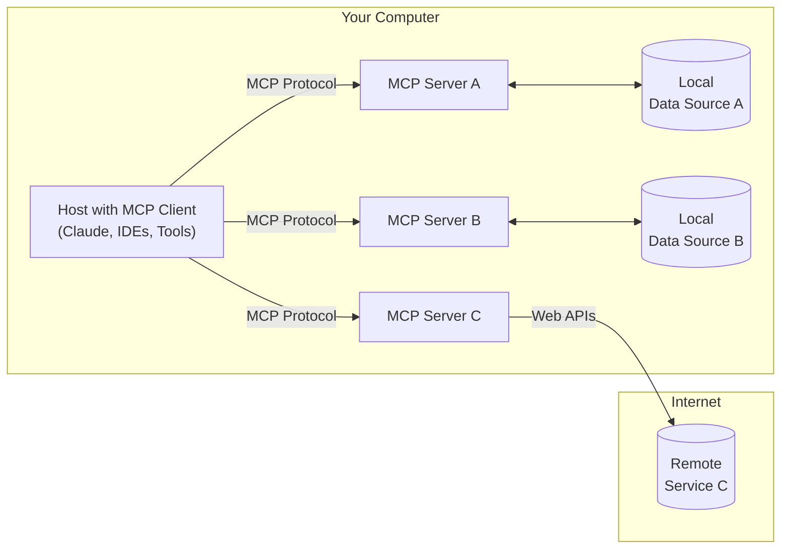
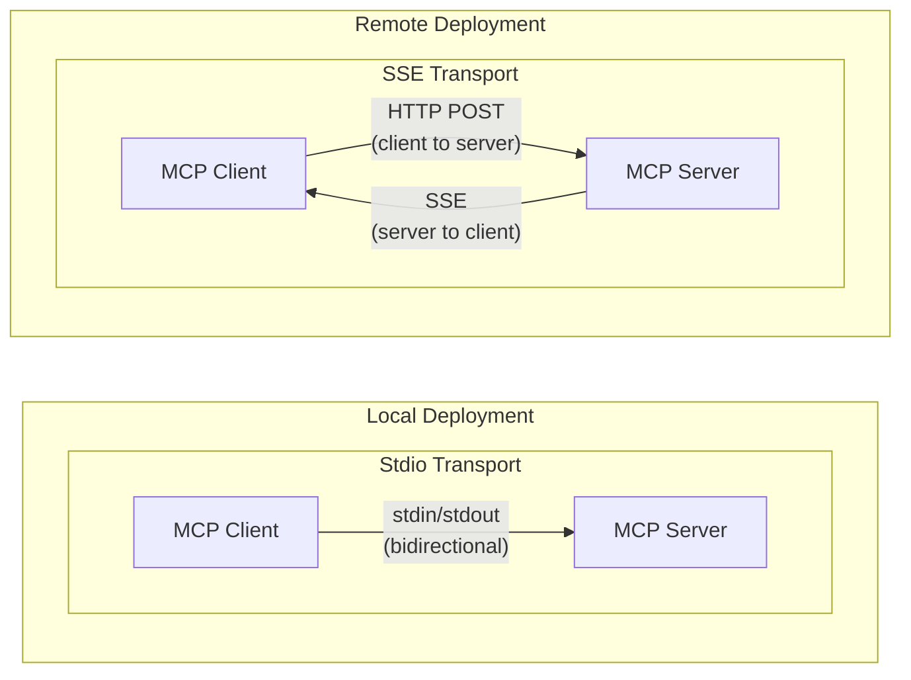

# AI Engineer

  

Runnable AI engineering modules: agents, MCP, memory, retrieval, voice, fine-tuning, MLOps, and security. Each top-level folder is one module, and this README covers all of them: what each one builds, how to run it, and what it needs.

## Why this repo?

Reading about AI engineering only goes so far. These modules run. You'll find:

- **19 modules** in three tiers, from first scripts to full services
- Agents in LangGraph and the OpenAI Agents SDK, plus a 7-lesson MCP course
- Redis for memory and retrieval, and a Neo4j knowledge graph
- Deploys to AWS, GKE, and Kubernetes
- A live voice agent and an LLM-based code detector
- Official prompting guides from 15 model providers, with offline PDFs

## Table of contents

- [Getting started](#getting-started)
- [Projects by difficulty](#projects-by-difficulty)
- [Beginner modules](#beginner-modules)
  - [OpenAI Agents SDK in TypeScript](#openai-agents-sdk-in-typescript)
  - [Redis basics](#redis-basics)
  - [Webhooks](#webhooks)
  - [FastAPI authentication](#fastapi-authentication)
  - [AWS EC2 with FastAPI](#aws-ec2-with-fastapi)
  - [Official prompting guides](#official-prompting-guides)
- [Intermediate modules](#intermediate-modules)
  - [LangGraph](#langgraph)
  - [OpenAI Agents SDK](#openai-agents-sdk)
  - [MCP crash course](#mcp-crash-course)
  - [Redis agent memory](#redis-agent-memory)
  - [Knowledge graph](#knowledge-graph)
  - [ElevenLabs voice agent](#elevenlabs-voice-agent)
  - [ML pipeline on GKE](#ml-pipeline-on-gke)
  - [Context engineering](#context-engineering)
- [Advanced modules](#advanced-modules)
  - [Agentic RAG with Redis](#agentic-rag-with-redis)
  - [GitHub sync](#github-sync)
  - [RAG on Kubernetes](#rag-on-kubernetes)
  - [AI code detector](#ai-code-detector)
  - [Hugging Face fine-tuning](#hugging-face-fine-tuning)
- [Contributing](#contributing)
- [License](#license)

## Getting started

Each module is self-contained. Find its section below, copy the keys it names into a `.env` in its folder, and run the commands.

1. **New to this?** Start with the [Beginner](#beginner-modules) modules, such as [Redis basics](#redis-basics) and [Webhooks](#webhooks).
2. **Build agents.** Move to [Intermediate](#intermediate-modules) with [LangGraph](#langgraph), [OpenAI Agents SDK](#openai-agents-sdk), and the [MCP crash course](#mcp-crash-course).
3. **Go deeper.** Try the [Advanced](#advanced-modules) modules: agentic RAG, Kafka pipelines, and Kubernetes.
4. **Know the tags.** `Project` is a runnable app. `Tutorial` is a set of small scripts. `Course` is an ordered series. `Reference` is material to read.

Most Python modules use [uv](https://docs.astral.sh/uv/). Python 3.13 or newer, and a current Node.js LTS for the TypeScript modules.

## Projects by difficulty

| Tier | Module | Type | Topic | Folder |
| :--- | :--- | :--- | :--- | :--- |
| 🟢 Beginner | [OpenAI Agents SDK in TypeScript](#openai-agents-sdk-in-typescript) | `Tutorial` | Agents | [`agent-sdk-ts/`](./agent-sdk-ts) |
| 🟢 Beginner | [Redis basics](#redis-basics) | `Tutorial` | Memory and retrieval | [`redis-basics/`](./redis-basics) |
| 🟢 Beginner | [Webhooks](#webhooks) | `Tutorial` | Events and integration | [`webhooks/`](./webhooks) |
| 🟢 Beginner | [FastAPI authentication](#fastapi-authentication) | `Project` | Security | [`fastapi-authentication/`](./fastapi-authentication) |
| 🟢 Beginner | [AWS EC2 with FastAPI](#aws-ec2-with-fastapi) | `Tutorial` | MLOps and cloud | [`aws-ec2-fastapi/`](./aws-ec2-fastapi) |
| 🟢 Beginner | [Official prompting guides](#official-prompting-guides) | `Reference` | Prompting | [`ai-dev-prompts/`](./ai-dev-prompts) |
| 🟡 Intermediate | [LangGraph](#langgraph) | `Tutorial` | Agents | [`langgraph/`](./langgraph) |
| 🟡 Intermediate | [OpenAI Agents SDK](#openai-agents-sdk) | `Tutorial` | Agents | [`openai-agents/`](./openai-agents) |
| 🟡 Intermediate | [MCP crash course](#mcp-crash-course) | `Course` | Agents | [`mcp-crash-course/`](./mcp-crash-course) |
| 🟡 Intermediate | [Redis agent memory](#redis-agent-memory) | `Tutorial` | Memory and retrieval | [`redis-agent-memory/`](./redis-agent-memory) |
| 🟡 Intermediate | [Knowledge graph](#knowledge-graph) | `Tutorial` | Memory and retrieval | [`knowledge-graph/`](./knowledge-graph) |
| 🟡 Intermediate | [ElevenLabs voice agent](#elevenlabs-voice-agent) | `Project` | Voice | [`elevenlabs-voice-agent/`](./elevenlabs-voice-agent) |
| 🟡 Intermediate | [ML pipeline on GKE](#ml-pipeline-on-gke) | `Project` | MLOps and cloud | [`mlops-github-actions-gke/`](./mlops-github-actions-gke) |
| 🟡 Intermediate | [Context engineering](#context-engineering) | `Reference` | Prompting | [`context-engineering/`](./context-engineering) |
| 🔴 Advanced | [Agentic RAG with Redis](#agentic-rag-with-redis) | `Project` | Memory and retrieval | [`agentic-rag-redis/`](./agentic-rag-redis) |
| 🔴 Advanced | [GitHub sync](#github-sync) | `Project` | Events and integration | [`github-sync/`](./github-sync) |
| 🔴 Advanced | [RAG on Kubernetes](#rag-on-kubernetes) | `Project` | MLOps and cloud | [`rag-on-kubernetes/`](./rag-on-kubernetes) |
| 🔴 Advanced | [AI code detector](#ai-code-detector) | `Project` | Security | [`ai-code-detector/`](./ai-code-detector) |
| 🔴 Advanced | [Hugging Face fine-tuning](#hugging-face-fine-tuning) | `Tutorial` | Fine-tuning | [`huggingface-finetuning/`](./huggingface-finetuning) |

---

## Beginner modules

Single ideas and small deploys. Start here.

### OpenAI Agents SDK in TypeScript

🟢 Beginner · `Tutorial` · [`agent-sdk-ts/`](./agent-sdk-ts)

The OpenAI Agents SDK from TypeScript. Three short scripts, each one idea.

| File | What it shows |
| :--- | :--- |
| `helloWorld.js` | Your first agent |
| `agentTool.js` | Use one agent as a tool for another |
| `dynamicInstructions.js` | Change an agent's instructions at run time |

**Run**

```bash
cd agent-sdk-ts
npm install
# Add OPENAI_API_KEY to .env
node helloWorld.js
```

**Depends on**

- A current Node.js LTS.
- An OpenAI API key.
- `@openai/agents`, `zod`, and `dotenv` (installed by `npm install`).

### Redis basics

🟢 Beginner · `Tutorial` · [`redis-basics/`](./redis-basics)

Redis data structures from two languages. Start here before you give an agent memory.

| Path | What it shows |
| :--- | :--- |
| `javascript/client.js` | Connect to Redis from Node.js |
| `javascript/string.js` | String commands |
| `javascript/list.js` | List commands |
| `javascript/server.js` | Redis behind a small server |
| `python/Redis.py` | The same ideas with `redis-py` |

**Run**

```bash
# Start Redis first
docker run -d -p 6379:6379 redis:7

cd redis-basics
python python/Redis.py
```

For the Node.js files, install the `redis` package (`npm install redis`) and run `node javascript/string.js`.

**Depends on**

- A running Redis on `localhost:6379`.
- Python 3 with `redis`, or Node.js with `redis`.

### Webhooks

🟢 Beginner · `Tutorial` · [`webhooks/`](./webhooks)

A practical webhook example with FastAPI: an order notification system. When a customer places an order, the system notifies an inventory system (to update stock), an email service (to send confirmation), and an analytics service (to track metrics).

| File | Role |
| :--- | :--- |
| `receiver.py` | Webhook receiver: the services that get notified |
| `sender.py` | Webhook sender: the order system that sends notifications |
| `test.py` | Demo script |

```
Customer places order
        ↓
Order System (sender.py)
        ↓
Sends webhooks to all subscribers
        ↓
    ┌───┴───┬────────┐
    ↓       ↓        ↓
Inventory Email  Analytics
(receiver.py endpoints)
```

**Run**

```bash
cd webhooks
uvicorn receiver:app --port 8000 --reload   # terminal 1
uvicorn sender:app --port 8001 --reload     # terminal 2
python test.py                              # terminal 3
```

Interactive docs: receiver at `http://localhost:8000/docs`, sender at `http://localhost:8001/docs`.

**Test by hand**

```bash
# 1. Register webhook subscribers
curl -X POST http://localhost:8001/subscribe \
  -H "Content-Type: application/json" \
  -d '{"url": "http://localhost:8000/webhook/inventory", "name": "Inventory"}'

curl -X POST http://localhost:8001/subscribe \
  -H "Content-Type: application/json" \
  -d '{"url": "http://localhost:8000/webhook/email", "name": "Email"}'

# 2. Create an order (triggers webhooks)
curl -X POST http://localhost:8001/order \
  -H "Content-Type: application/json" \
  -d '{"customer_email": "customer@example.com", "items": ["Laptop", "Mouse"], "total": 1050.00}'

# 3. Check subscribers
curl http://localhost:8001/subscribers
```

**Depends on**

- Python 3 with the packages in `webhooks/requirements.txt`.

### FastAPI authentication

🟢 Beginner · `Project` · [`fastapi-authentication/`](./fastapi-authentication)

A small FastAPI service with real password handling. Passwords hash with Argon2. Users log in and get a bearer token.

| Endpoint | What it does |
| :--- | :--- |
| `POST /users/` | Create a user |
| `POST /token` | Log in with form credentials and get a token |
| `GET /users/me` | Return the current user. Needs a bearer token |

**Run**

```bash
cd fastapi-authentication
uv sync
source .venv/bin/activate
uvicorn main:app --reload
```

Open `http://localhost:8000/docs` to try the endpoints.

**Depends on**

- Python 3.13 or newer.
- The database set in `database.py`. Check `.env` for the connection string.

### AWS EC2 with FastAPI

🟢 Beginner · `Tutorial` · [`aws-ec2-fastapi/`](./aws-ec2-fastapi)

A simple FastAPI app that pretends to be a bookstore (`main.py`, `books.json`), and how to deploy it to AWS EC2 behind NGINX, or to AWS Lambda. More commands are in [`aws-ec2-fastapi/Run_Commands.md`](./aws-ec2-fastapi/Run_Commands.md).

**Deploy to AWS EC2**

1. Create an EC2 instance (`t2.micro`) with the latest stable Ubuntu AMI.
2. [SSH into the instance](https://aws.amazon.com/blogs/compute/new-using-amazon-ec2-instance-connect-for-ssh-access-to-your-ec2-instances/) and install the dependencies:

   ```bash
   sudo apt-get update
   sudo apt install -y python3-pip nginx
   ```

3. Copy the app to the instance (`main.py`, `books.json`, `requirements.txt`) and install its requirements.
4. Add an NGINX site config. Replace the IP with your instance's public IP:

   ```bash
   sudo vim /etc/nginx/sites-enabled/fastapi_nginx
   ```

   ```
   server {
       listen 80;
       server_name <YOUR_EC2_IP>;
       location / {
           proxy_pass http://127.0.0.1:8000;
       }
   }
   ```

5. Restart NGINX and start FastAPI:

   ```bash
   sudo service nginx restart
   python3 -m uvicorn main:app
   ```

6. Allow HTTP traffic on port 80 in the instance's security group. Visit the public IP to reach the API.

**Deploy to AWS Lambda**

Add a Lambda handler with Mangum:

```python
from mangum import Mangum

app = FastAPI()
handler = Mangum(app)
```

Install the dependencies into a local folder, zip them, then add the app files:

```bash
pip install -t lib -r requirements.txt
(cd lib; zip ../lambda_function.zip -r .)
zip lambda_function.zip -u main.py
zip lambda_function.zip -u books.json
```

**Depends on**

- An AWS account. Never commit your `.pem` key file.

### Official prompting guides

🟢 Beginner · `Reference` · [`ai-dev-prompts/`](./ai-dev-prompts)

A curated index of prompting guides published **by the model providers themselves**. No third-party blogs, no "ultimate prompt" threads. If a provider ships a model-specific guide, it is listed next to the general one, because advice changes between model generations.

Every guide that is a public web page also has an offline PDF copy in `ai-dev-prompts/<provider>/`, captured in October 2026. The links are the source of truth; the PDFs are snapshots and will go stale as providers update their docs.

Providers: [Anthropic](#anthropic-claude) · [OpenAI](#openai-gpt-o-series-codex) · [Google](#google-gemini-gemma) · [Meta](#meta-llama) · [Mistral](#mistral) · [Cohere](#cohere-command) · [xAI](#xai-grok) · [DeepSeek](#deepseek) · [Qwen](#alibaba-qwen) · [Kimi](#moonshot-kimi) · [Amazon](#amazon-nova-bedrock) · [Microsoft](#microsoft-azure-openai) · [IBM](#ibm-granite) · [AI21](#ai21-jamba) · [Perplexity](#perplexity-sonar)

#### Anthropic (Claude)

| Guide | Covers | Offline |
| --- | --- | --- |
| [Prompt engineering overview](https://platform.claude.com/docs/en/build-with-claude/prompt-engineering/overview) | Where to start, when prompting is (and isn't) the fix | [PDF](./ai-dev-prompts/anthropic/Claude%20Prompt%20Engineering%20Overview.pdf) |
| [Prompting best practices](https://platform.claude.com/docs/en/build-with-claude/prompt-engineering/claude-prompting-best-practices) | The living reference: clarity, examples, XML tags, roles, thinking, long context, agents | [PDF](./ai-dev-prompts/anthropic/Claude%20Prompting%20Best%20Practices.pdf) |
| [Prompting Claude Opus 5.5](https://platform.claude.com/docs/en/build-with-claude/prompt-engineering/prompting-claude-opus-5-5) | Model-specific notes for Opus 5.5 | [PDF](./ai-dev-prompts/anthropic/Prompting%20Claude%20Opus%205.5.pdf) |
| [Prompting Claude Sonnet 5.5](https://platform.claude.com/docs/en/build-with-claude/prompt-engineering/prompting-claude-sonnet-5-5) | Model-specific notes for Sonnet 5.5 | [PDF](./ai-dev-prompts/anthropic/Prompting%20Claude%20Sonnet%205.5.pdf) |
| [Prompting Claude Haiku 5.5](https://platform.claude.com/docs/en/build-with-claude/prompt-engineering/prompting-claude-haiku-5-5) | Model-specific notes for Haiku 5.5 | [PDF](./ai-dev-prompts/anthropic/Prompting%20Claude%20Haiku%205.5.pdf) |
| [Prompting Claude Fable 5.1](https://platform.claude.com/docs/en/build-with-claude/prompt-engineering/prompting-claude-fable-5-1) | Model-specific notes for Fable 5.1 | [PDF](./ai-dev-prompts/anthropic/Prompting%20Claude%20Fable%205.1.pdf) |
| [Extended thinking](https://platform.claude.com/docs/en/build-with-claude/extended-thinking) | Prompting and budgeting reasoning | [PDF](./ai-dev-prompts/anthropic/Claude%20Extended%20Thinking.pdf) |
| [System prompt release notes](https://platform.claude.com/docs/en/release-notes/system-prompts/overview) | Anthropic's own published claude.ai system prompts | — |
| [Interactive prompt engineering tutorial](https://github.com/anthropics/prompt-eng-interactive-tutorial) | 9-chapter hands-on course (Jupyter) | — |
| [Anthropic courses](https://github.com/anthropics/courses) | API fundamentals, real-world prompting, prompt evals, tool use | — |
| [Effective context engineering for AI agents](https://www.anthropic.com/engineering/effective-context-engineering-for-ai-agents) | Context as a finite resource for agents | [PDF](./ai-dev-prompts/anthropic/Effective%20Context%20Engineering%20for%20AI%20Agents.pdf) |
| [Writing tools for agents](https://www.anthropic.com/engineering/writing-tools-for-agents) | Tool descriptions as prompts | [PDF](./ai-dev-prompts/anthropic/Writing%20Tools%20for%20Agents.pdf) |
| [Claude Code best practices](https://www.anthropic.com/engineering/claude-code-best-practices) | Prompting an agentic coding tool | [PDF](./ai-dev-prompts/anthropic/Claude%20Code%20Best%20Practices.pdf) |

#### OpenAI (GPT, o-series, Codex)

| Guide | Covers | Offline |
| --- | --- | --- |
| [Prompting](https://developers.openai.com/api/docs/guides/prompting) | Current general guide: messages, roles, reusable prompts | [PDF](./ai-dev-prompts/openai/OpenAI%20Prompting.pdf) |
| [Prompt engineering](https://developers.openai.com/api/docs/guides/prompt-engineering) | Core strategies and message formatting | [PDF](./ai-dev-prompts/openai/OpenAI%20Prompt%20Engineering.pdf) |
| [Using GPT-6](https://developers.openai.com/api/docs/guides/latest-model/gpt-6-astra) | Latest model family, with a prompting best practices section | [PDF](./ai-dev-prompts/openai/Using%20GPT-6.pdf) |
| [Reasoning best practices](https://developers.openai.com/api/docs/guides/reasoning-best-practices) | How to prompt reasoning models differently from chat models | [PDF](./ai-dev-prompts/openai/OpenAI%20Reasoning%20Best%20Practices.pdf) |
| [GPT-5.2 prompting guide](https://developers.openai.com/cookbook/examples/gpt-5/gpt-5-2_prompting_guide) | `reasoning_effort`, verbosity, agentic scaffolding | [PDF](./ai-dev-prompts/openai/GPT-5.2%20Prompting%20Guide.pdf) |
| [GPT-5.1 prompting guide](https://cookbook.openai.com/examples/gpt-5/gpt-5-1_prompting_guide) | Personality, steerability, `none` reasoning mode | [PDF](./ai-dev-prompts/openai/GPT-5.1%20Prompting%20Guide.pdf) |
| [GPT-5 prompting guide](https://cookbook.openai.com/examples/gpt-5/gpt-5_prompting_guide) | Agentic eagerness, tool preambles, coding | [PDF](./ai-dev-prompts/openai/GPT-5%20Prompting%20Guide.pdf) |
| [GPT-4.1 prompting guide](https://cookbook.openai.com/examples/gpt4-1_prompting_guide) | Literal instruction following, long context, agent prompts | [PDF](./ai-dev-prompts/openai/GPT-4.1%20Prompting%20Guide.pdf) |
| [o3 / o4-mini prompting guide](https://developers.openai.com/cookbook/examples/o-series/o3o4-mini_prompting_guide) | Function calling with reasoning models | [PDF](./ai-dev-prompts/openai/o3%20and%20o4-mini%20Prompting%20Guide.pdf) |
| [Codex prompting guide (cookbook)](https://developers.openai.com/cookbook/examples/gpt-5/codex_prompting_guide) | Prompting Codex models for coding agents | [PDF](./ai-dev-prompts/openai/Codex%20Prompting%20Guide.pdf) |
| [Prompting Codex](https://developers.openai.com/codex/prompting) | Writing good tasks for the Codex agent | [PDF](./ai-dev-prompts/openai/Prompting%20Codex.pdf) |
| [Prompt optimization cookbook](https://cookbook.openai.com/examples/gpt-5/prompt-optimization-cookbook) | Using the prompt optimizer to fix contradictions and ambiguity | [PDF](./ai-dev-prompts/openai/Prompt%20Optimization%20Cookbook.pdf) |
| [Prompting Realtime models](https://developers.openai.com/api/docs/guides/voice-prompting) | Voice agents: tone, pacing, turn-taking | [PDF](./ai-dev-prompts/openai/Prompting%20Realtime%20Models.pdf) |
| [Realtime prompting guide (cookbook)](https://cookbook.openai.com/examples/realtime_prompting_guide) | Worked voice-agent prompt examples | [PDF](./ai-dev-prompts/openai/Realtime%20Prompting%20Guide.pdf) |
| [Prompting GPT-Live](https://developers.openai.com/api/docs/guides/live-prompting) | Live speech model prompting | [PDF](./ai-dev-prompts/openai/Prompting%20GPT-Live.pdf) |
| [Image prompting](https://developers.openai.com/api/docs/guides/image-prompting) | Prompting image generation and editing | [PDF](./ai-dev-prompts/openai/OpenAI%20Image%20Prompting.pdf) |
| [Image gen models prompting guide](https://cookbook.openai.com/examples/multimodal/image-gen-models-prompting-guide) | Worked image prompt examples | [PDF](./ai-dev-prompts/openai/Image%20Gen%20Models%20Prompting%20Guide.pdf) |
| [Sora 2 prompting guide](https://cookbook.openai.com/examples/sora/sora2_prompting_guide) | Video: shots, camera, timing, style | [PDF](./ai-dev-prompts/openai/Sora%202%20Prompting%20Guide.pdf) |
| [A practical guide to building agents](https://cdn.openai.com/business-guides-and-resources/a-practical-guide-to-building-agents.pdf) | Agent instructions, tools, guardrails | [PDF](./ai-dev-prompts/openai/A%20Practical%20Guide%20to%20Building%20Agents.pdf) |

#### Google (Gemini, Gemma)

| Guide | Covers | Offline |
| --- | --- | --- |
| [Prompt design strategies](https://ai.google.dev/gemini-api/docs/prompting-strategies) | Core Gemini API prompting guide | [PDF](./ai-dev-prompts/google/Gemini%20Prompt%20Design%20Strategies.pdf) |
| [Gemini 3 developer guide](https://ai.google.dev/gemini-api/docs/gemini-3) | Gemini 3 prompting changes: temperature, thinking level, shorter prompts | [PDF](./ai-dev-prompts/google/Gemini%203%20Developer%20Guide.pdf) |
| [What's new in Gemini 3.5 Flash](https://ai.google.dev/gemini-api/docs/generate-content/whats-new-gemini-3.5) | Migration and prompting notes for 3.5 | [PDF](./ai-dev-prompts/google/Whats%20New%20in%20Gemini%203.5%20Flash.pdf) |
| [File prompting strategies](https://ai.google.dev/gemini-api/docs/file-prompting-strategies) | Prompting with images, video, audio, PDFs | [PDF](./ai-dev-prompts/google/Gemini%20File%20Prompting%20Strategies.pdf) |
| [Image generation (Nano Banana)](https://ai.google.dev/gemini-api/docs/image-generation) | Image prompts and editing | [PDF](./ai-dev-prompts/google/Gemini%20Image%20Generation.pdf) |
| [Video generation (Veo 3.1)](https://ai.google.dev/gemini-api/docs/veo) | Veo 3.1 usage and prompt guide | [PDF](./ai-dev-prompts/google/Veo%203.1%20Video%20Generation%20and%20Prompt%20Guide.pdf) |
| [Lyria prompt guide](https://ai.google.dev/gemini-api/docs/lyria-prompt-guide) | Music generation prompting | [PDF](./ai-dev-prompts/google/Lyria%20Prompt%20Guide.pdf) |
| [Introduction to prompting (Google Cloud)](https://cloud.google.com/vertex-ai/generative-ai/docs/learn/prompts/introduction-prompt-design) | Enterprise prompting docs and strategies | [PDF](./ai-dev-prompts/google/Google%20Cloud%20Introduction%20to%20Prompting.pdf) |
| [Gemma prompt structure](https://ai.google.dev/gemma/docs/core/prompt-structure) | Gemma chat template and formatting | [PDF](./ai-dev-prompts/google/Gemma%20Prompt%20Structure.pdf) |
| [Gemini for Workspace prompt guide](https://workspace.google.com/learning/content/gemini-prompt-guide) | Prompting Gemini in Docs, Gmail, Sheets | — |
| [Prompt engineering whitepaper](https://www.kaggle.com/whitepaper-prompt-engineering) | Google's 68-page model-agnostic whitepaper | [PDF](./ai-dev-prompts/google/Prompt%20Engineering%20Whitepaper.pdf) |

#### Meta (Llama)

| Guide | Covers | Offline |
| --- | --- | --- |
| [Prompt engineering](https://www.llama.com/docs/how-to-guides/prompting/) | Official Llama prompting how-to | [PDF](./ai-dev-prompts/meta/Llama%20Prompt%20Engineering.pdf) |
| [Model cards and prompt formats](https://www.llama.com/docs/model-cards-and-prompt-formats/) | Special tokens and chat templates per Llama version | [PDF](./ai-dev-prompts/meta/Llama%20Model%20Cards%20and%20Prompt%20Formats.pdf) |

#### Mistral

| Guide | Covers | Offline |
| --- | --- | --- |
| [Prompting capabilities](https://docs.mistral.ai/guides/prompting_capabilities) | System vs user prompts, Markdown/XML structure, few-shot, worked examples | [PDF](./ai-dev-prompts/mistral/Mistral%20Prompting%20Capabilities.pdf) |

#### Cohere (Command)

| Guide | Covers | Offline |
| --- | --- | --- |
| [Crafting effective prompts](https://docs.cohere.com/docs/crafting-effective-prompts) | General Command prompting | [PDF](./ai-dev-prompts/cohere/Cohere%20Crafting%20Effective%20Prompts.pdf) |
| [Prompting Command R / R+](https://docs.cohere.com/docs/prompting-command-r) | Model-specific template, RAG and tool-use prompts | [PDF](./ai-dev-prompts/cohere/Prompting%20Command%20R.pdf) |

#### xAI (Grok)

| Guide | Covers | Offline |
| --- | --- | --- |
| [Speech-to-speech prompting guide](https://docs.x.ai/developers/model-capabilities/audio/speech-to-speech/prompting-guide) | Prompting Grok voice agents | [PDF](./ai-dev-prompts/xai/Grok%20Speech-to-Speech%20Prompting%20Guide.pdf) |

xAI has no general text prompting guide right now. See the [docs home](https://docs.x.ai/docs).

#### DeepSeek

| Guide | Covers | Offline |
| --- | --- | --- |
| [DeepSeek-R1 usage recommendations](https://github.com/deepseek-ai/DeepSeek-R1#usage-recommendations) | Temperature, no few-shot, math directive, forcing `<think>` | [PDF](./ai-dev-prompts/deepseek/DeepSeek-R1%20Usage%20Recommendations.pdf) |
| [Thinking mode guide](https://api-docs.deepseek.com/guides/thinking_mode) | Using thinking mode via API | [PDF](./ai-dev-prompts/deepseek/DeepSeek%20Thinking%20Mode%20Guide.pdf) |
| [Prompt library](https://api-docs.deepseek.com/prompt-library/) | Official example prompts by task | — |

#### Alibaba (Qwen)

| Guide | Covers | Offline |
| --- | --- | --- |
| [Qwen documentation](https://qwen.readthedocs.io/en/latest/) | Chat templates, thinking mode, function calling | — |

#### Moonshot (Kimi)

| Guide | Covers | Offline |
| --- | --- | --- |
| [Best practices for prompts](https://platform.kimi.ai/docs/guide/prompt-best-practice) | Official Kimi prompting guide | [PDF](./ai-dev-prompts/moonshot/Kimi%20Prompt%20Best%20Practices.pdf) |

#### Amazon (Nova, Bedrock)

| Guide | Covers | Offline |
| --- | --- | --- |
| [Nova 2 prompt engineering guide](https://docs.aws.amazon.com/nova/latest/nova2-userguide/prompt-engineering-guide.html) | Current Nova generation | [PDF](./ai-dev-prompts/amazon/Amazon%20Nova%202%20Prompt%20Engineering%20Guide.pdf) |
| [Nova (v1) prompting best practices](https://docs.aws.amazon.com/nova/latest/userguide/prompting.html) | Text, vision, image/video gen, speech | [PDF](./ai-dev-prompts/amazon/Amazon%20Nova%20Prompting%20Best%20Practices.pdf) |
| [Bedrock prompt engineering concepts](https://docs.aws.amazon.com/bedrock/latest/userguide/prompt-engineering-guidelines.html) | Hub linking to each Bedrock model's guide | [PDF](./ai-dev-prompts/amazon/Bedrock%20Prompt%20Engineering%20Concepts.pdf) |

#### Microsoft (Azure OpenAI)

| Guide | Covers | Offline |
| --- | --- | --- |
| [Prompt engineering techniques](https://learn.microsoft.com/en-us/azure/ai-foundry/openai/concepts/prompt-engineering) | System messages, few-shot, grounding on Azure OpenAI | [PDF](./ai-dev-prompts/microsoft/Azure%20OpenAI%20Prompt%20Engineering%20Techniques.pdf) |

#### IBM (Granite)

| Guide | Covers | Offline |
| --- | --- | --- |
| [Granite prompt engineering guide](https://www.ibm.com/granite/docs/use-cases/prompt-engineering) | Prompt templates and techniques for Granite | [PDF](./ai-dev-prompts/ibm/Granite%20Prompt%20Engineering%20Guide.pdf) |

#### AI21 (Jamba)

| Guide | Covers | Offline |
| --- | --- | --- |
| [Prompt engineering for Jamba](https://docs.ai21.com/docs/prompt-engineering) | Jamba-specific prompting | [PDF](./ai-dev-prompts/ai21/Jamba%20Prompt%20Engineering.pdf) |

#### Perplexity (Sonar)

| Guide | Covers | Offline |
| --- | --- | --- |
| [Prompt guide](https://docs.perplexity.ai/docs/agent-api/prompt-guide) | Prompting search-grounded models | [PDF](./ai-dev-prompts/perplexity/Perplexity%20Prompt%20Guide.pdf) |

#### About the PDFs

- Web pages were printed with headless Chrome, and large images were downscaled to keep the folder small.
- The Amazon Nova guides are split across many pages online, so each PDF merges a whole section into one file.
- `openai/GPT-4.1 Prompting Guide.pdf` and `openai/A Practical Guide to Building Agents.pdf` are OpenAI's own PDFs, and `google/Prompt Engineering Whitepaper.pdf` is Google's.
- No PDFs for GitHub repos, docs home pages, or the Gemini for Workspace guide (it is behind a sign-up form).
- To add a guide: it must be published by the model's provider. Put the newest model-specific guide first in its provider's table, and add a PDF snapshot to the provider's folder.

---

## Intermediate modules

Agents, memory, voice, and CI/CD pipelines.

### LangGraph

🟡 Intermediate · `Tutorial` · [`langgraph/`](./langgraph)

Stateful agents as explicit graphs. Each folder adds one idea: a basic graph, a tool-calling chatbot, ReAct, RAG, memory, a drafting agent, and the workflow patterns from Anthropic's agent guide.

| Folder | Contents |
| :--- | :--- |
| `Basics/` | Your first graph |
| `Chatbot/` | A chatbot with tools |
| `Agent/` | `Agent_Bot`, `ReAct_Bot`, `Memory_Bot`, `RAG`, and `Drafter` |
| `Workflows + Agents/` | Augmented LLM, prompt chaining, parallelization |
| `Subgraphs/` | Graphs nested inside graphs |
| `Advanced AI Agent/` | A larger agent (`main.py`) with its own `pyproject.toml` |

**Run**

```bash
cd langgraph
uv pip install -r Basics/requirements.txt
# Add OPENAI_API_KEY to .env
python Agent/ReAct_Bot.py
```

Each folder with a `requirements.txt` lists its own extra packages.

**Depends on**

- A recent Python 3.
- An OpenAI API key.

### OpenAI Agents SDK

🟡 Intermediate · `Tutorial` · [`openai-agents/`](./openai-agents)

The OpenAI Agents SDK in Python, from first agent to multi-agent routing.

| Path | What it shows |
| :--- | :--- |
| `Agent SDK/agents-sdk-intro.py` | The SDK in one file |
| `Agent/01_Simple_Agent.py` | A single agent and a runner |
| `Agent/02_Graph_Visualization.py` | Drawing the agent graph |
| `Agent/03_Guardrails.py` | An input guardrail that flags churn-risk messages |
| `Agent/04_Manager_Agent.py` | A manager agent that delegates to others |
| `Agentic Patterns/1. Router Agent.py` | Route a request to the right specialist |
| `Agentic Patterns/2. Triage Agent.py` | Triage, then hand off |

**Run**

```bash
cd openai-agents
uv pip install openai-agents python-dotenv pydantic
# Add OPENAI_API_KEY to .env
python Agent/01_Simple_Agent.py
```

**Depends on**

- A recent Python 3.
- An OpenAI API key.

### MCP crash course

🟡 Intermediate · `Course` · [`mcp-crash-course/`](./mcp-crash-course)

The Model Context Protocol (MCP) gives LLMs a standard way to connect to external data sources and tools. This course takes Python developers from the core concepts to servers and clients that use prompts, resources, and tools.

| Lesson | Folder |
| :--- | :--- |
| 1. [Introduction and context](#1-introduction-and-context) | `1-introduction-and-context/` |
| 2. [Understanding MCP](#2-understanding-mcp) | `2-understanding-mcp/` |
| 3. [Simple server setup with the Python SDK](#3-simple-server-setup-with-the-python-sdk) | `3-simple-server-setup/` |
| 4. [OpenAI integration](#4-openai-integration) | `4-openai-integration/` |
| 5. [MCP vs function calling](#5-mcp-vs-function-calling) | `5-mcp-vs-function-calling/` |
| 6. [Running with Docker](#6-running-with-docker) | `6-run-with-docker/` |
| 7. [Lifecycle management](#7-lifecycle-management) | `7-lifecycle-management/` |

**Set up**

```bash
cd mcp-crash-course
uv pip install -r requirements.txt   # or: pip install -r requirements.txt
```

The MCP CLI has helpers for development and testing:

```bash
mcp dev server.py       # test a server with the MCP Inspector
mcp install server.py   # install a server in Claude Desktop
mcp run server.py       # run a server directly
```

**Resources:** [MCP documentation](https://modelcontextprotocol.io) · [MCP specification](https://spec.modelcontextprotocol.io) · [Python SDK](https://github.com/modelcontextprotocol/python-sdk) · [Official servers](https://github.com/modelcontextprotocol/servers) · [Core architecture](https://modelcontextprotocol.io/docs/concepts/architecture)

#### 1. Introduction and context

**The hype vs. reality.** MCP isn't a new technology. It's a new standard. If you've built AI agents, you've already done the core idea: giving LLMs tools through function calling. MCP standardizes how those tools are exposed and called.

**Personal use vs. backend integration.** Most tutorials show how to plug MCP servers into Claude Desktop, Cursor, or other personal assistants. This course covers the other case: building MCP into your own Python applications and agent systems. You will:

- Understand the technical architecture of MCP
- Build custom MCP servers with the Python SDK
- Integrate those servers into Python applications
- Decide when and how to use MCP

#### 2. Understanding MCP

**Architecture.** MCP uses a client-host-server design, so each server can focus on one domain (file access, web search, a database):

- **MCP hosts**: programs like Claude Desktop, IDEs, or your Python app that want data through MCP
- **MCP clients**: protocol clients that keep 1:1 connections with servers
- **MCP servers**: lightweight programs that expose capabilities (tools, resources, prompts)
- **Local data sources**: files, databases, and services on your computer
- **Remote services**: external systems reachable over the internet



**Three primitives** a server can implement:

1. [Tools](https://modelcontextprotocol.io/docs/concepts/tools#python): model-controlled functions the LLM can call (API calls, computations)
2. [Resources](https://modelcontextprotocol.io/docs/concepts/resources#python): application-controlled data that gives context (file contents, database records)
3. [Prompts](https://modelcontextprotocol.io/docs/concepts/prompts#python): user-controlled templates for LLM interactions

Tools are the most useful primitive for Python developers.

**Transports.**

- **Stdio**: talks over standard input and output. Best when client and server are on the same machine, and during development. No network setup.
- **SSE (Server-Sent Events)**: HTTP for client-to-server, SSE for server-to-client. Use it for remote access or distributed setups.



If you know FastAPI, an SSE MCP server will feel familiar: HTTP endpoints, async handlers, and streaming responses.

**Why a standard matters:** build a server once and use it with any MCP client (reusability), combine servers (composability), and use servers others have built (ecosystem). See the [official servers](https://github.com/modelcontextprotocol/servers).

#### 3. Simple server setup with the Python SDK

A first server with one tool:

```python
# server.py
from mcp.server.fastmcp import FastMCP

mcp = FastMCP("DemoServer")

@mcp.tool()
def say_hello(name: str) -> str:
    """Say hello to someone

    Args:
        name: The person's name to greet
    """
    return f"Hello, {name}! Nice to meet you."

if __name__ == "__main__":
    mcp.run()
```

Ways to run it:

- `mcp dev server.py` runs it with the MCP Inspector, a web UI for trying tools and resources.
- `mcp install server.py` adds it to Claude Desktop's config.
- `python server.py` or `uv run server.py` runs it directly (only needed for SSE).

By default a server uses the stdio transport, not a network port. To serve over HTTP, switch to SSE:

```python
from mcp.server.fastmcp import FastMCP

mcp = FastMCP("MyServer", host="127.0.0.1", port=8050)

# Add your tools and resources here...

if __name__ == "__main__":
    mcp.run(transport="sse")   # serves at http://127.0.0.1:8050
```

A stdio client that starts the server and calls a tool:

```python
import asyncio
from mcp import ClientSession, StdioServerParameters
from mcp.client.stdio import stdio_client

async def main():
    server_params = StdioServerParameters(command="python", args=["server.py"])
    async with stdio_client(server_params) as (read_stream, write_stream):
        async with ClientSession(read_stream, write_stream) as session:
            await session.initialize()
            tools_result = await session.list_tools()
            print("Available tools:")
            for tool in tools_result.tools:
                print(f"  - {tool.name}: {tool.description}")
            result = await session.call_tool("add", arguments={"a": 2, "b": 3})
            print(f"2 + 3 = {result.content[0].text}")

if __name__ == "__main__":
    asyncio.run(main())
```

The SSE client is the same, but connects with `sse_client` instead:

```python
from mcp.client.sse import sse_client

async with sse_client("http://localhost:8050/sse") as (read_stream, write_stream):
    ...
```

**Which to choose:** use stdio when the client starts the server process itself. Use HTTP (SSE) when the server runs separately, on another machine or container. For production backends, HTTP gives better separation and scaling.

#### 4. OpenAI integration

Connect OpenAI to an MCP server so the model can call your tools while it answers. The server (`server.py`) exposes a `get_knowledge_base` tool that reads Q&A pairs about company policies from `data/kb.json`. The client (`client.py`) connects to the server, converts MCP tools to OpenAI's function format, and passes results back to the model.

**Data flow:**

1. The user asks a question, for example "What is our company's vacation policy?"
2. OpenAI receives the query and the tools from the MCP server.
3. OpenAI decides which tools to call.
4. The MCP client forwards the tool call to the MCP server.
5. The server runs the tool and returns the data.
6. The result flows back through the client to OpenAI.
7. OpenAI writes the final answer with the tool data.

MCP acts as a standard bridge: one interface for tools, your backend hidden behind it, control over exactly what is exposed, and freedom to change the backend without changing the AI integration.

**Run**

```bash
cd mcp-crash-course/4-openai-integration
# Add OPENAI_API_KEY to .env
python client.py
```

This example uses stdio, so the client starts the server as a subprocess. To run them separately, use SSE as shown in [lesson 3](#3-simple-server-setup-with-the-python-sdk).

#### 5. MCP vs function calling

Compare the MCP version to a plain function-calling version in `function-calling.py`. At this small scale, plain function calling is simpler. MCP pays off when:

- You share tools across several applications.
- Components run on different machines.
- You want to use existing MCP servers from the ecosystem.
- Standardization helps your users.

Plain function calling is better for small self-contained apps, when performance is critical (less overhead), or early in development when speed of iteration matters more than standards.

#### 6. Running with Docker

Run an MCP server with a calculator tool in Docker. Files: `server.py`, `client.py`, `Dockerfile`, `requirements.txt`.

```bash
cd mcp-crash-course/6-run-with-docker
docker build -t mcp-server .
docker run -p 8050:8050 mcp-server
python client.py   # in another terminal; adds 2 and 3
```

The server uses SSE on port 8050 and binds to `0.0.0.0` so it is reachable from outside the container. The client connects to `http://localhost:8050/sse`. Start the server before the client.

**Troubleshooting:** check the container is running (`docker ps`), check the port mapping, read the logs (`docker logs <container_id>`), and check firewall settings. If Docker runs on a remote machine, make sure the port is reachable.

#### 7. Lifecycle management

Lifecycle management covers how MCP clients and servers start, run, and stop, so resources are allocated and released correctly.

1. **Initialization**: the client connects, both sides negotiate a protocol version, and the server prepares to handle calls.

   ```python
   async with stdio_client(server_params) as (read, write):
       async with ClientSession(read, write) as session:
           await session.initialize()
   ```

2. **Operation**: the server exposes tools, the client discovers and calls them, and the server manages the resources they need.

   ```python
   tools_result = await session.list_tools()
   result = await session.call_tool(
       tool_call.function.name,
       arguments=json.loads(tool_call.function.arguments),
   )
   ```

3. **Termination**: resources are released and connections closed. This happens when you exit the context manager.

**The lifespan object** manages app-level resources for the whole life of a server. It sets them up at start, makes them available to every tool, and cleans them up at shutdown:

```python
from contextlib import asynccontextmanager
from collections.abc import AsyncIterator
from dataclasses import dataclass

from mcp.server.fastmcp import Context, FastMCP

@dataclass
class AppContext:
    db: Database  # Replace with your actual resource type

@asynccontextmanager
async def app_lifespan(server: FastMCP) -> AsyncIterator[AppContext]:
    db = await Database.connect()
    try:
        yield AppContext(db=db)
    finally:
        await db.disconnect()

mcp = FastMCP("My App", lifespan=app_lifespan)

@mcp.tool()
def query_db(ctx: Context) -> str:
    """Tool that uses initialized resources"""
    db = ctx.request_context.lifespan_context.db
    return db.query()
```

Benefits: type safety, guaranteed setup and cleanup, dependency injection into tools, and resource management kept apart from tool code. See the [MCP lifecycle spec](https://modelcontextprotocol.io/specification/2025-03-26/basic/lifecycle#lifecycle).

### Redis agent memory

🟡 Intermediate · `Tutorial` · [`redis-agent-memory/`](./redis-agent-memory)

Two LangGraph agents that remember.

| File | What it does |
| :--- | :--- |
| `short_term_memory.py` | Keeps the current conversation in Redis, so a thread survives restarts |
| `long_term_memory_agent.py` | Stores facts across threads and recalls them in later sessions |

**Run**

```bash
# Start Redis first
docker run -d -p 6379:6379 redis:7

cd redis-agent-memory
uv pip install langchain_openai langgraph langgraph-checkpoint-redis redis
export REDIS_URI=redis://localhost:6379
export OPENAI_API_KEY=...
python long_term_memory_agent.py
```

**Depends on**

- A running Redis, reachable at `REDIS_URI`.
- An OpenAI API key.
- Read [Redis basics](#redis-basics) first if Redis is new to you.

### Knowledge graph

🟡 Intermediate · `Tutorial` · [`knowledge-graph/`](./knowledge-graph)

Turn text into entities and relations, then query the graph instead of searching chunks. This module pairs an LLM graph extractor with a Neo4j quickstart. Stack: LangChain, OpenAI, Neo4j, PyVis.

| Path | What it does |
| :--- | :--- |
| [`KG.py`](./knowledge-graph/KG.py) | Extracts a graph from documents with `LLMGraphTransformer` and draws it with PyVis |
| [`Neo4j/Quickstart.py`](./knowledge-graph/Neo4j/Quickstart.py) | Connects to Neo4j and runs a first query |
| [`config.py`](./knowledge-graph/config.py) | Reads your API keys from `.env` |

**Run**

```bash
cd knowledge-graph
uv pip install langchain-experimental langchain-openai pyvis neo4j python-dotenv
# Add OPENAI_API_KEY to .env
python KG.py
```

**Depends on**

- An OpenAI API key.
- A running Neo4j instance for `Neo4j/Quickstart.py`.

### ElevenLabs voice agent

🟡 Intermediate · `Project` · [`elevenlabs-voice-agent/`](./elevenlabs-voice-agent)

A live voice agent for a clinic front desk. You speak, the agent answers, and it calls client-side tools to look up patient records and book appointments.

| File | Role |
| :--- | :--- |
| `main.py` | Opens a conversation with your ElevenLabs agent and wires the microphone and speaker |
| `patient_records.py` | The patient lookup the agent calls |
| `setup_tools.py` | Registers the tools with your ElevenLabs agent |
| `Makefile` | `install`, `setup`, `tools`, `run` |

**Run**

```bash
cd elevenlabs-voice-agent
make setup      # installs PortAudio and Python packages, creates .env
# Add ELEVENLABS_API_KEY and ELEVENLABS_AGENT_ID to .env
make tools      # registers the tools
make run        # starts the conversation
```

**Depends on**

- An ElevenLabs account with a Conversational AI agent.
- A microphone and speakers.
- PortAudio (`make install` handles macOS, Linux, and Windows).

### ML pipeline on GKE

🟡 Intermediate · `Project` · [`mlops-github-actions-gke/`](./mlops-github-actions-gke)

A complete ML delivery loop. Data processing and training run as a pipeline. A Flask app serves the model. Docker packages it. A GitHub Actions workflow deploys it to Google Kubernetes Engine on every push to `main`.

| Path | Role |
| :--- | :--- |
| `src/data_processing.py` | Reads `artifacts/raw/data.csv` and prepares train and test sets |
| `src/model_training.py` | Trains a decision tree and reports accuracy, precision, recall, F1, and a confusion matrix |
| `training_pipeline.py` | Runs both steps in order |
| `application.py` and `templates/` | Flask app that serves predictions |
| `Dockerfile` and `kubernetes-deployment.yaml` | Container and cluster config |
| `.github/workflows/deploy.yml` | CI/CD to GKE |

**Run**

```bash
cd mlops-github-actions-gke
uv pip install -r requirements.txt
python training_pipeline.py   # needs artifacts/raw/data.csv
python application.py
```

GitHub only runs workflows from a repository's root `.github/workflows/`. To use the deploy workflow, copy it there, replace `<PROJECT_ID>` in `deploy.yml` and `kubernetes-deployment.yaml` with your GCP project ID, and set the GCP secrets it names.

**Depends on**

- A dataset at `artifacts/raw/data.csv`. The repo doesn't ship it.
- A GCP project, a GKE cluster, and a service account for the deploy step. Never commit the key file.
- Docker.

### Context engineering

🟡 Intermediate · `Reference` · [`context-engineering/`](./context-engineering)

A template for context engineering: giving AI coding assistants all the information they need to finish a job end to end. Prompt engineering is about wording a task, like handing someone a sticky note. Context engineering is a full system of documentation, examples, rules, patterns, and validation, like handing them a screenplay.

Why it matters:

1. **Fewer failures.** Most agent failures are context failures, not model failures.
2. **Consistency.** The AI follows your project's patterns and conventions.
3. **Complex features.** Multi-step work becomes possible with the right context.
4. **Self-correction.** Validation loops let the AI fix its own mistakes.

**What's in the folder**

```
context-engineering/
├── .claude/commands/
│   ├── generate-prp.md        # Generates comprehensive PRPs
│   └── execute-prp.md         # Executes PRPs to implement features
├── PRPs/
│   ├── templates/prp_base.md  # Base template for PRPs
│   └── EXAMPLE_multi_agent_prp.md
├── examples/                  # Your code examples (critical!)
├── CLAUDE.md                  # Global rules for the AI assistant
├── INITIAL.md                 # Template for feature requests
└── INITIAL_EXAMPLE.md         # Example feature request
```

**Quick start (in Claude Code)**

1. Edit `CLAUDE.md` with your project rules: project awareness, code structure, testing, style, and documentation standards.
2. Put relevant code examples in `examples/`.
3. Describe the feature in `INITIAL.md`. See `INITIAL_EXAMPLE.md`.
4. Generate a PRP (Product Requirements Prompt): `/generate-prp INITIAL.md`
5. Run it: `/execute-prp PRPs/your-feature-name.md`

The slash commands live in `.claude/commands/`. `$ARGUMENTS` receives whatever you pass after the command name.

**Writing `INITIAL.md`**

```markdown
## FEATURE:
[What you want to build. Be specific about functionality and requirements]

## EXAMPLES:
[Example files in examples/ and how to use them]

## DOCUMENTATION:
[Links to relevant docs, APIs, or MCP server resources]

## OTHER CONSIDERATIONS:
[Gotchas, specific requirements, things AI assistants often miss]
```

- **Feature:** be specific. Not "Build a web scraper" but "Build an async web scraper using BeautifulSoup that extracts product data from e-commerce sites, handles rate limiting, and stores results in PostgreSQL."
- **Examples:** point to files in `examples/` and say what to copy.
- **Documentation:** API docs, library guides, MCP server docs, database schemas.
- **Other considerations:** auth, rate limits, common pitfalls, performance needs.

**The PRP workflow**

A PRP is like a PRD, but written to instruct an AI coding assistant: full context, implementation steps with validation gates, error handling patterns, and test requirements.

- `/generate-prp` reads the feature request, researches the codebase for patterns, gathers docs and gotchas, writes a step-by-step plan with validation gates, and scores its confidence from 1 to 10.
- `/execute-prp` loads the PRP, plans with a task list, implements each part, runs tests and linting, fixes issues, and checks every success criterion.

See `PRPs/EXAMPLE_multi_agent_prp.md` for a full example.

**Using examples well**

AI assistants do much better when they can see patterns. Include code structure (modules, imports, class and function patterns), testing (file layout, mocking, assertions), integrations (API clients, database connections, auth), and CLI patterns (argument parsing, output, error handling).

**Best practices**

1. Be explicit in `INITIAL.md`. Don't assume the AI knows your preferences.
2. Provide plenty of examples, including what not to do.
3. Use validation gates. PRPs include test commands that must pass.
4. Include official docs and specific sections.
5. Customize `CLAUDE.md` with your conventions.

Resources: [Claude Code documentation](https://docs.anthropic.com/en/docs/claude-code) · [Context engineering best practices](https://www.philschmid.de/context-engineering)

---

## Advanced modules

Full services and production patterns.

### Agentic RAG with Redis

🔴 Advanced · `Project` · [`agentic-rag-redis/`](./agentic-rag-redis)

An agentic RAG pipeline built as a LangGraph graph on a Redis vector store, with query rewriting and relevance grading. The sample question asks what Lilian Weng wrote about the types of agent memory.

| Path | Role |
| :--- | :--- |
| `src/agents/` | The graph: `nodes.py`, `edges.py`, `graph.py`, and a Mermaid diagram helper |
| `src/retriever.py` | Redis-backed retriever |
| `src/cache/` | Redis connection and cache |
| `src/config/` | OpenAI and app settings |
| `src/main.py` | Streams a question through the graph |

**Run**

```bash
# Start Redis first
docker run -d -p 6379:6379 redis/redis-stack:latest

cd agentic-rag-redis
uv sync
# Add OPENAI_API_KEY and your Redis URL to .env
cd src && uv run python main.py
```

**Depends on**

- Python 3.13 or newer (see `.python-version`).
- A Redis with vector search support. Redis Stack works.
- An OpenAI API key.

### GitHub sync

🔴 Advanced · `Project` · [`github-sync/`](./github-sync)

A full-stack GitHub dashboard. A React client signs you in and shows commits, pull requests, repositories, and organizations. A FastAPI server talks to the GitHub API. Kafka carries events between producer and consumer.

| Path | Role |
| :--- | :--- |
| `client/` | React and Vite UI |
| `server/Github/` | FastAPI app with routers for commits, pull requests, repositories, organizations |
| `server/Auth/` | Sign-in |
| `server/Kafka/` | `Producer.py` and `Consumer.py` |
| `server/docker-compose.yml` | Kafka and ZooKeeper for local use |
| `server/Postman/` | A Postman collection |

**Run**

```bash
# Kafka
cd github-sync/server
docker compose up -d

# API server
uv sync
cp .env.example .env   # add GITHUB_TOKEN
cd Github && uv run python main.py   # docs at http://localhost:8000/docs

# Kafka producer and consumer tests (from github-sync/server)
uv run python Kafka/Producer.py
uv run python Kafka/Consumer.py

# Client
cd github-sync/client
bun install            # or: npm install
bun run dev            # or: npm run dev; opens http://localhost:3000
```

**API endpoints**

| Method | Endpoint | Description |
| :--- | :--- | :--- |
| GET | `/org/user` | Get the authenticated user |
| GET | `/org/user/orgs` | List user organizations |
| GET | `/org/orgs/{org}` | Get organization info |
| GET | `/org/orgs/{org}/repos` | List org repositories |
| GET | `/repos/{owner}/{repo}` | Get repository details |
| GET | `/repos/{owner}/{repo}/commits` | List commits |
| GET | `/repos/{owner}/{repo}/commits/{commit_sha}` | Get commit details |
| GET | `/repos/{owner}/{repo}/pulls` | List pull requests |
| GET | `/repos/{owner}/{repo}/pulls/{pull_number}` | Get PR details |
| GET | `/repos/{owner}/{repo}/pulls/{pull_number}/commits` | List PR commits |

**Client sign-in**

- **GitHub OAuth (recommended):** create an OAuth app at [github.com/settings/developers](https://github.com/settings/developers) and set `VITE_GITHUB_CLIENT_ID`, `VITE_GITHUB_CLIENT_SECRET`, and `VITE_GITHUB_REDIRECT_URI` in `client/.env`. `VITE_API_URL` defaults to `http://localhost:8000`. In production, do the OAuth token exchange on the server.
- **Personal access token (fallback):** create a [token](https://github.com/settings/tokens) with `repo` and `read:org` scopes and choose "Use personal access token" on the login page.

The client validates the token by calling `/org/user`, stores it in `localStorage`, and adds it to every API request through `src/services/api.js` (axios). Protected routes check auth state from `AuthContext`.

```
client/src/
├── components/          # Login, Dashboard, UserProfile, OrganizationsList
├── contexts/            # AuthContext: authentication state
├── services/api.js      # API client
├── App.jsx              # Routes
└── main.jsx             # Entry point
```

Scripts: `dev`, `build`, and `preview`, with Bun or npm. The client doubles as a small React primer: components, `useState`, the Context API, React Router, and `useEffect` (see `client/REACT_GUIDE.md` and `client/BUN_GUIDE.md`). Ideas to extend it: more GitHub data, error boundaries, loading skeletons, pagination, and search.

**Kafka notes**

Apache Kafka is a distributed event store and stream-processing platform.

- **Topics** are streams of related messages, defined by developers. A topic is a logical grouping, and producers and topics are many-to-many.
- **Brokers** receive and store messages from producers. A cluster can have many brokers, and each broker manages several partitions.
- **Producers** write data as messages, from any language or the command-line tool.
- **Consumers** pull messages from one or more topics. Each consumer's offset (the last message read) is kept in a special topic.
- **ZooKeeper** is a distributed key-value store that holds configuration, ACLs, and secrets, and coordinates the cluster.

Glossary:

- **Stream:** an unbounded sequence of ordered, immutable data.
- **Stream processing:** continual calculations on one or more streams.
- **Event:** an immutable fact about something that happened in the system.
- **Cluster:** a group of brokers working together.
- **Partition:** a log inside a topic that guarantees ordering for its data. Partitions are chosen by hashing keys.
- **ZooKeeper's role:** tells brokers which one leads each partition and tracks cluster membership and config.

**Depends on**

- Docker, for Kafka.
- A current Node.js LTS (or Bun) for the client.
- Python 3.13 or newer for the server.
- A GitHub OAuth app or token.

### RAG on Kubernetes

🔴 Advanced · `Project` · [`rag-on-kubernetes/`](./rag-on-kubernetes)

A RAG API packaged for Kubernetes, with Prometheus monitoring and a faster retrieval pipeline.

| Path | Role |
| :--- | :--- |
| `rag-app/` | FastAPI service with `/health`, `/ingest`, and `/query`. Uses OpenAI embeddings and an LLM, and a JSON vector store. Has a Dockerfile, Makefile, manifests in `k8s/`, and a Postman collection |
| `monitoring/` | A `monitoring` namespace and a Prometheus deployment that scrapes the `rag-app` pods |
| `python/` | Faster RAG: recursive chunking, hybrid dense and BM25 retrieval, and an embedding cache |

**Run locally**

```bash
cd rag-on-kubernetes/rag-app
cp .env.example .env   # add OPENAI_API_KEY

# with Docker
docker compose up --build

# or without Docker
python -m venv .venv && source .venv/bin/activate
pip install -r requirements.txt
uvicorn app.main:app --reload
```

**Try it**

```bash
curl -X POST http://localhost:8000/ingest \
  -H "Content-Type: application/json" \
  -d '{"documents":[{"text":"Hello RAG","metadata":{"source":"demo"}}]}'

curl -X POST http://localhost:8000/query \
  -H "Content-Type: application/json" \
  -d '{"query":"What is this about?"}'
```

**Run on Minikube**

```bash
cd rag-on-kubernetes/rag-app
make minikube-start
eval $(make minikube-docker-env)
make docker-build
make secret-create
make apply
make service
```

Then deploy monitoring from `rag-on-kubernetes/`:

```bash
kubectl apply -f monitoring/namespace.yaml
kubectl apply -f monitoring/prometheus-config.yaml
kubectl apply -f monitoring/deployment.yaml
minikube service prometheus -n monitoring
```

**Depends on**

- Docker.
- Minikube and `kubectl`, or another Kubernetes cluster.
- An OpenAI API key.

### AI code detector

🔴 Advanced · `Project` · [`ai-code-detector/`](./ai-code-detector)

An Express and TypeScript backend that asks Claude whether a piece of code looks AI-generated. It also takes GitHub webhooks, so it can check pull requests and commits as they arrive.

| Path | Role |
| :--- | :--- |
| `backend/src/services/detect.ts` | Sends code to Claude and parses the JSON verdict |
| `backend/src/services/github.ts` and `routes/github.ts` | GitHub integration |
| `backend/src/utils/githubSignature.ts` | Verifies webhook signatures |
| `backend/src/db/db.ts` | PostgreSQL connection |
| `postman/` | A Postman collection with sample requests |

**Run**

```bash
cd ai-code-detector/backend
npm install
# Add ANTHROPIC_API_KEY and DATABASE_URL to .env
npm run dev
```

**Depends on**

- A current Node.js LTS.
- An Anthropic API key.
- A PostgreSQL database.

### Hugging Face fine-tuning

🔴 Advanced · `Tutorial` · [`huggingface-finetuning/`](./huggingface-finetuning)

Train and evaluate open-source models. The notebook fine-tunes a small LLM and measures the gain, so you see before and after numbers instead of a guess. Stack: Transformers, PEFT, Datasets, PyTorch.

| Path | What it does |
| :--- | :--- |
| [`hf-model-trainer-skill.ipynb`](./huggingface-finetuning/hf-model-trainer-skill.ipynb) | Fine-tunes `Qwen/Qwen3-0.6B` to route customer support tickets. Trains on the Bitext customer support dataset and compares routing metrics before and after, with plots |

**Run**

1. Open the notebook in Jupyter, VS Code, or Colab.
2. Run the setup cell. It installs the dependencies with `uv`, or with `pip` if you prefer.
3. Run the cells in order. A GPU speeds up training. Apple Silicon (MPS) also works.

**Depends on**

- A Hugging Face account and token for dataset and model downloads.

---

## Contributing

Contributions are welcome. Read [CONTRIBUTING.md](CONTRIBUTING.md) first.

1. Open a **Module proposal** [issue](../../issues/new/choose) for a new module.
2. Fork the repository and create a branch.
3. Improve a module, or add a new top-level folder for one.
4. Document it in this README only: add a row to [Projects by difficulty](#projects-by-difficulty) and a section under the right tier, using the [module section template](.github/MODULE_SECTION_TEMPLATE.md). Modules don't have their own README files.
5. Open a pull request. The template lists the checks.

Report a leaked secret through [private reporting](SECURITY.md). Everyone must follow the [Code of Conduct](CODE_OF_CONDUCT.md).

## License

MIT. See [LICENSE](LICENSE).

Created by Kushal Banda.
