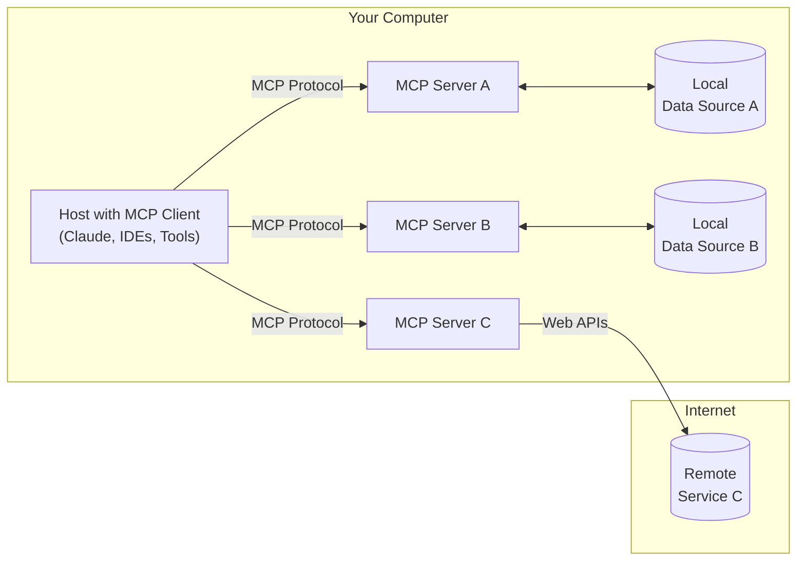
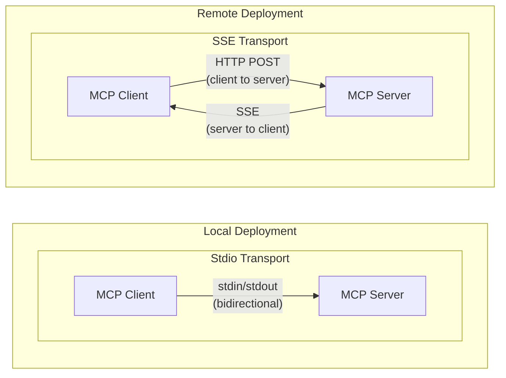

# MCP crash course

[← AI Engineer](../README.md)

**Level:** 🟡 Intermediate · **Type:** `Course` · Commands run from the repo root.

The Model Context Protocol (MCP) gives LLMs a standard way to connect to external data sources and tools. This course takes Python developers from the core concepts to servers and clients that use prompts, resources, and tools.

| Lesson | Code |
| :--- | :--- |
| 1. [Introduction and context](#1-introduction-and-context) | — (reading only) |
| 2. [Understanding MCP](#2-understanding-mcp) | — (reading only) |
| 3. [Simple server setup with the Python SDK](#3-simple-server-setup-with-the-python-sdk) | [`3-simple-server-setup/`](./3-simple-server-setup/) |
| 4. [OpenAI integration](#4-openai-integration) | [`4-openai-integration/`](./4-openai-integration/) |
| 5. [MCP vs function calling](#5-mcp-vs-function-calling) | [`5-mcp-vs-function-calling/`](./5-mcp-vs-function-calling/) |
| 6. [Running with Docker](#6-running-with-docker) | [`6-run-with-docker/`](./6-run-with-docker/) |
| 7. [Lifecycle management](#7-lifecycle-management) | — (reading only) |

## Set up

```bash
cd mcp-crash-course
uv pip install -r requirements.txt   # or: pip install -r requirements.txt
```

The MCP CLI has helpers for development and testing:

```bash
mcp dev server.py       # test a server with the MCP Inspector
mcp install server.py   # install a server in Claude Desktop
mcp run server.py       # run a server directly
```

**Resources:** [MCP documentation](https://modelcontextprotocol.io) · [MCP specification](https://spec.modelcontextprotocol.io) · [Python SDK](https://github.com/modelcontextprotocol/python-sdk) · [Official servers](https://github.com/modelcontextprotocol/servers) · [Core architecture](https://modelcontextprotocol.io/docs/concepts/architecture)

## 1. Introduction and context

**The hype vs. reality.** MCP isn't a new technology. It's a new standard. If you've built AI agents, you've already done the core idea: giving LLMs tools through function calling. MCP standardizes how those tools are exposed and called.

**Personal use vs. backend integration.** Most tutorials show how to plug MCP servers into Claude Desktop, Cursor, or other personal assistants. This course covers the other case: building MCP into your own Python applications and agent systems. You will:

- Understand the technical architecture of MCP
- Build custom MCP servers with the Python SDK
- Integrate those servers into Python applications
- Decide when and how to use MCP

## 2. Understanding MCP

**Architecture.** MCP uses a client-host-server design, so each server can focus on one domain (file access, web search, a database):

- **MCP hosts**: programs like Claude Desktop, IDEs, or your Python app that want data through MCP
- **MCP clients**: protocol clients that keep 1:1 connections with servers
- **MCP servers**: lightweight programs that expose capabilities (tools, resources, prompts)
- **Local data sources**: files, databases, and services on your computer
- **Remote services**: external systems reachable over the internet



**Three primitives** a server can implement:

1. [Tools](https://modelcontextprotocol.io/docs/concepts/tools#python): model-controlled functions the LLM can call (API calls, computations)
2. [Resources](https://modelcontextprotocol.io/docs/concepts/resources#python): application-controlled data that gives context (file contents, database records)
3. [Prompts](https://modelcontextprotocol.io/docs/concepts/prompts#python): user-controlled templates for LLM interactions

Tools are the most useful primitive for Python developers.

### Transports.

- **Stdio**: talks over standard input and output. Best when client and server are on the same machine, and during development. No network setup.
- **SSE (Server-Sent Events)**: HTTP for client-to-server, SSE for server-to-client. Use it for remote access or distributed setups.



If you know FastAPI, an SSE MCP server will feel familiar: HTTP endpoints, async handlers, and streaming responses.

**Why a standard matters:** build a server once and use it with any MCP client (reusability), combine servers (composability), and use servers others have built (ecosystem). See the [official servers](https://github.com/modelcontextprotocol/servers).

## 3. Simple server setup with the Python SDK

A first server with one tool:

```python
# server.py
from mcp.server.fastmcp import FastMCP

mcp = FastMCP("DemoServer")

@mcp.tool()
def say_hello(name: str) -> str:
    """Say hello to someone

    Args:
        name: The person's name to greet
    """
    return f"Hello, {name}! Nice to meet you."

if __name__ == "__main__":
    mcp.run()
```

Ways to run it:

- `mcp dev server.py` runs it with the MCP Inspector, a web UI for trying tools and resources.
- `mcp install server.py` adds it to Claude Desktop's config.
- `python server.py` or `uv run server.py` runs it directly (only needed for SSE).

By default a server uses the stdio transport, not a network port. To serve over HTTP, switch to SSE:

```python
from mcp.server.fastmcp import FastMCP

mcp = FastMCP("MyServer", host="127.0.0.1", port=8050)

# Add your tools and resources here...

if __name__ == "__main__":
    mcp.run(transport="sse")   # serves at http://127.0.0.1:8050
```

A stdio client that starts the server and calls a tool:

```python
import asyncio
from mcp import ClientSession, StdioServerParameters
from mcp.client.stdio import stdio_client

async def main():
    server_params = StdioServerParameters(command="python", args=["server.py"])
    async with stdio_client(server_params) as (read_stream, write_stream):
        async with ClientSession(read_stream, write_stream) as session:
            await session.initialize()
            tools_result = await session.list_tools()
            print("Available tools:")
            for tool in tools_result.tools:
                print(f"  - {tool.name}: {tool.description}")
            result = await session.call_tool("add", arguments={"a": 2, "b": 3})
            print(f"2 + 3 = {result.content[0].text}")

if __name__ == "__main__":
    asyncio.run(main())
```

The SSE client is the same, but connects with `sse_client` instead:

```python
from mcp.client.sse import sse_client

async with sse_client("http://localhost:8050/sse") as (read_stream, write_stream):
    ...
```

**Which to choose:** use stdio when the client starts the server process itself. Use HTTP (SSE) when the server runs separately, on another machine or container. For production backends, HTTP gives better separation and scaling.

## 4. OpenAI integration

Connect OpenAI to an MCP server so the model can call your tools while it answers. The server (`server.py`) exposes a `get_knowledge_base` tool that reads Q&A pairs about company policies from `data/kb.json`. The client (`client.py`) connects to the server, converts MCP tools to OpenAI's function format, and passes results back to the model.

### Data flow:

1. The user asks a question, for example "What is our company's vacation policy?"
2. OpenAI receives the query and the tools from the MCP server.
3. OpenAI decides which tools to call.
4. The MCP client forwards the tool call to the MCP server.
5. The server runs the tool and returns the data.
6. The result flows back through the client to OpenAI.
7. OpenAI writes the final answer with the tool data.

MCP acts as a standard bridge: one interface for tools, your backend hidden behind it, control over exactly what is exposed, and freedom to change the backend without changing the AI integration.

### Run

```bash
cd mcp-crash-course/4-openai-integration
# Add OPENAI_API_KEY to .env
python client.py
```

This example uses stdio, so the client starts the server as a subprocess. To run them separately, use SSE as shown in [lesson 3](#3-simple-server-setup-with-the-python-sdk).

## 5. MCP vs function calling

Compare the MCP version to a plain function-calling version in `function-calling.py`. At this small scale, plain function calling is simpler. MCP pays off when:

- You share tools across several applications.
- Components run on different machines.
- You want to use existing MCP servers from the ecosystem.
- Standardization helps your users.

Plain function calling is better for small self-contained apps, when performance is critical (less overhead), or early in development when speed of iteration matters more than standards.

## 6. Running with Docker

Run an MCP server with a calculator tool in Docker. Files: `server.py`, `client.py`, `Dockerfile`, `requirements.txt`.

```bash
cd mcp-crash-course/6-run-with-docker
docker build -t mcp-server .
docker run -p 8050:8050 mcp-server
python client.py   # in another terminal; adds 2 and 3
```

The server uses SSE on port 8050 and binds to `0.0.0.0` so it is reachable from outside the container. The client connects to `http://localhost:8050/sse`. Start the server before the client.

**Troubleshooting:** check the container is running (`docker ps`), check the port mapping, read the logs (`docker logs <container_id>`), and check firewall settings. If Docker runs on a remote machine, make sure the port is reachable.

## 7. Lifecycle management

Lifecycle management covers how MCP clients and servers start, run, and stop, so resources are allocated and released correctly.

1. **Initialization**: the client connects, both sides negotiate a protocol version, and the server prepares to handle calls.

   ```python
   async with stdio_client(server_params) as (read, write):
       async with ClientSession(read, write) as session:
           await session.initialize()
   ```

2. **Operation**: the server exposes tools, the client discovers and calls them, and the server manages the resources they need.

   ```python
   tools_result = await session.list_tools()
   result = await session.call_tool(
       tool_call.function.name,
       arguments=json.loads(tool_call.function.arguments),
   )
   ```

3. **Termination**: resources are released and connections closed. This happens when you exit the context manager.

**The lifespan object** manages app-level resources for the whole life of a server. It sets them up at start, makes them available to every tool, and cleans them up at shutdown:

```python
from contextlib import asynccontextmanager
from collections.abc import AsyncIterator
from dataclasses import dataclass

from mcp.server.fastmcp import Context, FastMCP

@dataclass
class AppContext:
    db: Database  # Replace with your actual resource type

@asynccontextmanager
async def app_lifespan(server: FastMCP) -> AsyncIterator[AppContext]:
    db = await Database.connect()
    try:
        yield AppContext(db=db)
    finally:
        await db.disconnect()

mcp = FastMCP("My App", lifespan=app_lifespan)

@mcp.tool()
def query_db(ctx: Context) -> str:
    """Tool that uses initialized resources"""
    db = ctx.request_context.lifespan_context.db
    return db.query()
```

Benefits: type safety, guaranteed setup and cleanup, dependency injection into tools, and resource management kept apart from tool code. See the [MCP lifecycle spec](https://modelcontextprotocol.io/specification/2025-03-26/basic/lifecycle#lifecycle).
